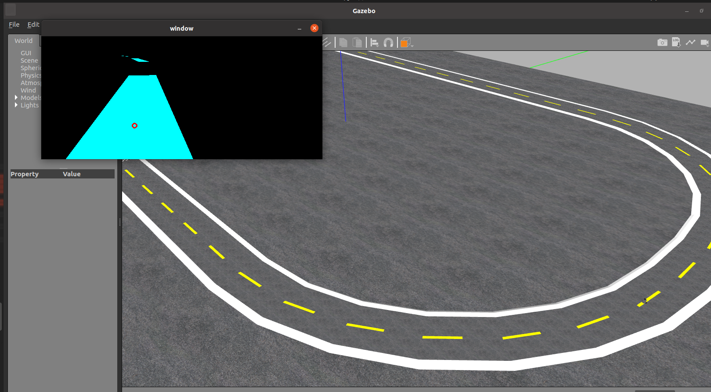

# turtlebot3_wandou

基于turtlebot3添加kinect摄像头实现比例控制寻线

gazebo模拟环境，ros控制

使用方法

1. 下载代码

```
git clone https://github.com/wandouyu1/turtlebot3_wandou.git
```

2. 环境

```
ros noetic
```

3. 编译

```
cd turtlebot3_wandou
catkin_make
source devel/setup.bash   
```


4. 运行

```
export TURTLEBOT3_MODEL=burger
roslaunch turtlebot3_gazebo my.launch
rosrun control_wandou tiqu.py
```

5. 运行结果


    
